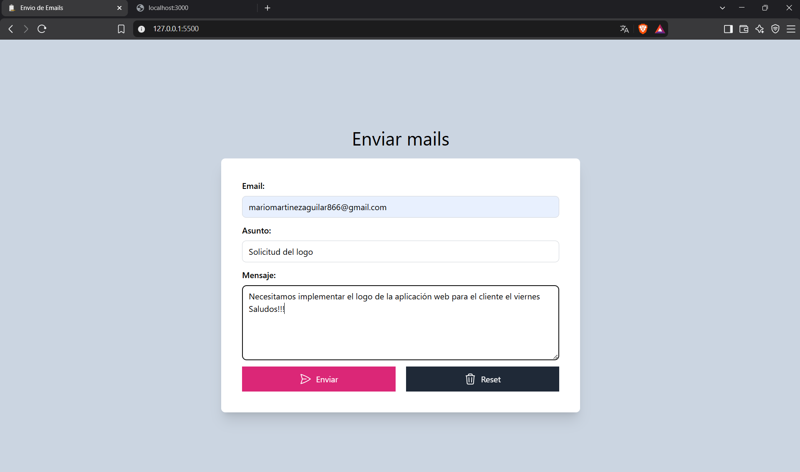
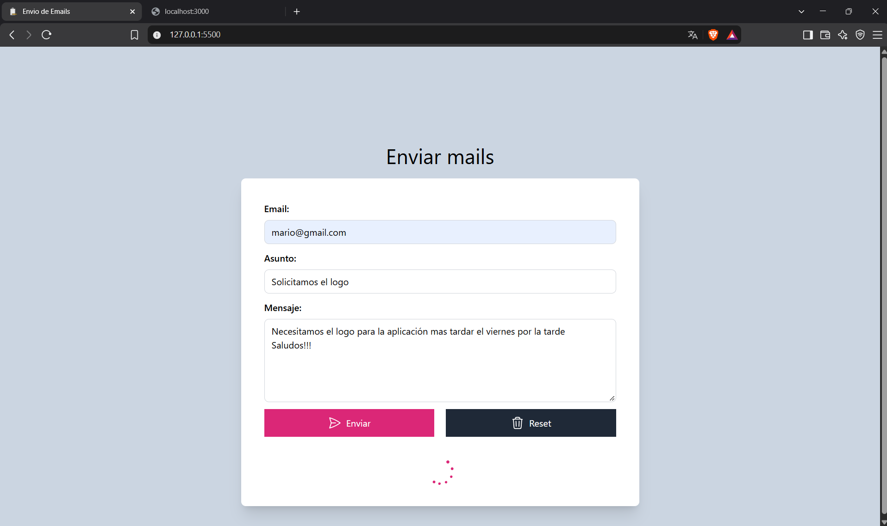
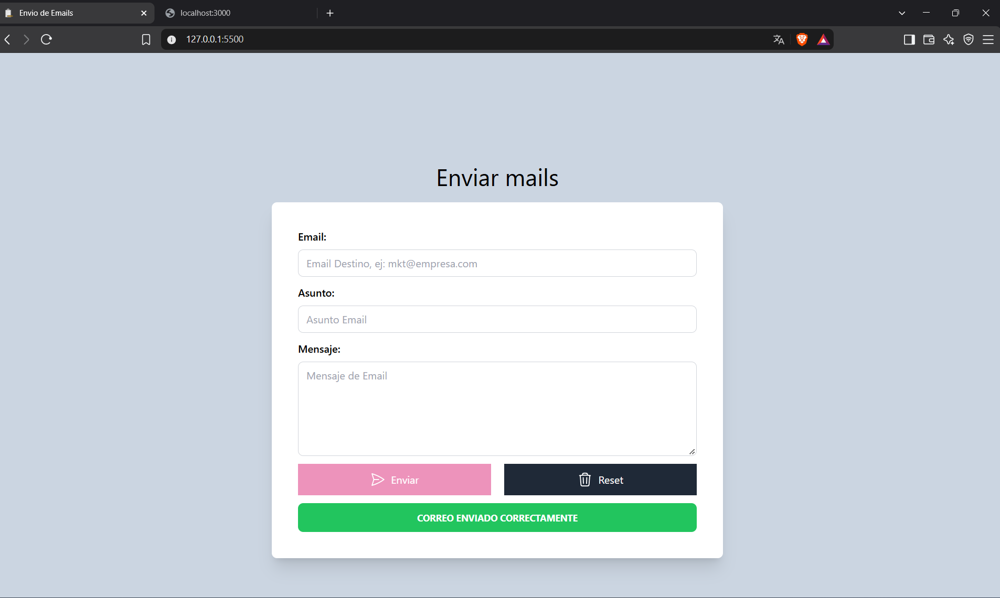
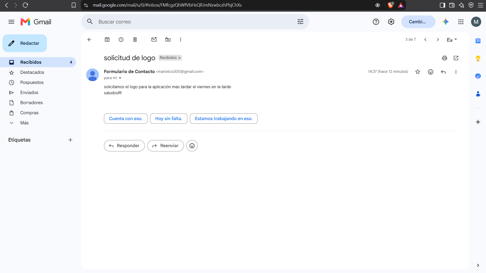
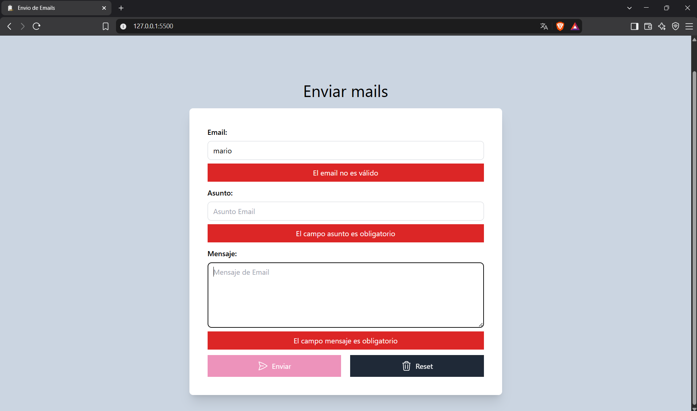
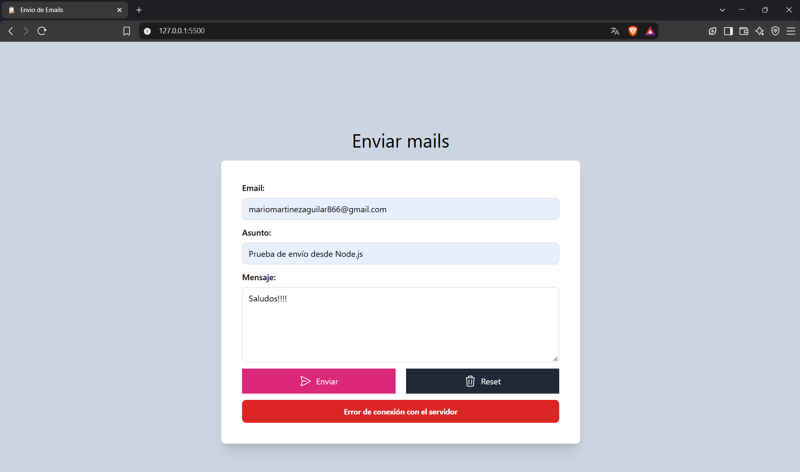
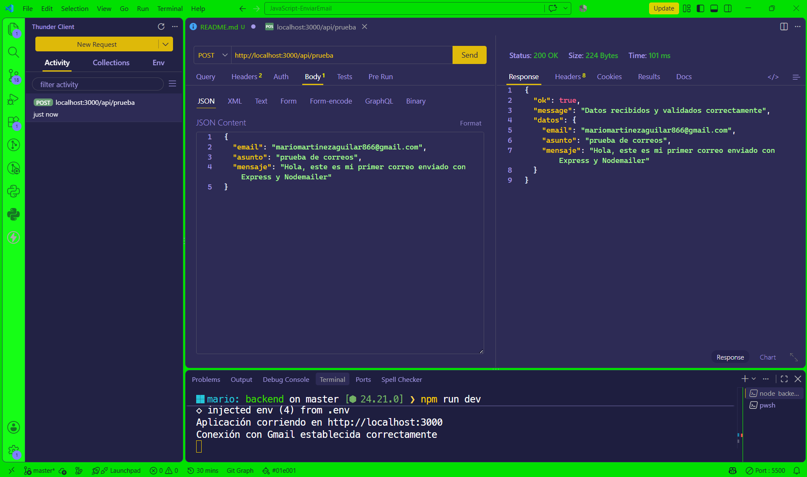
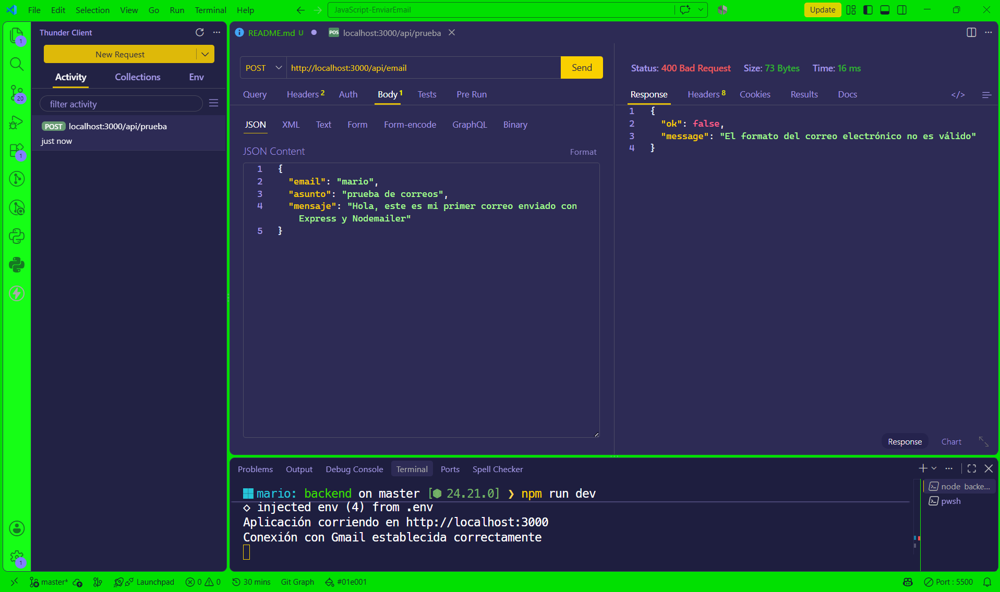
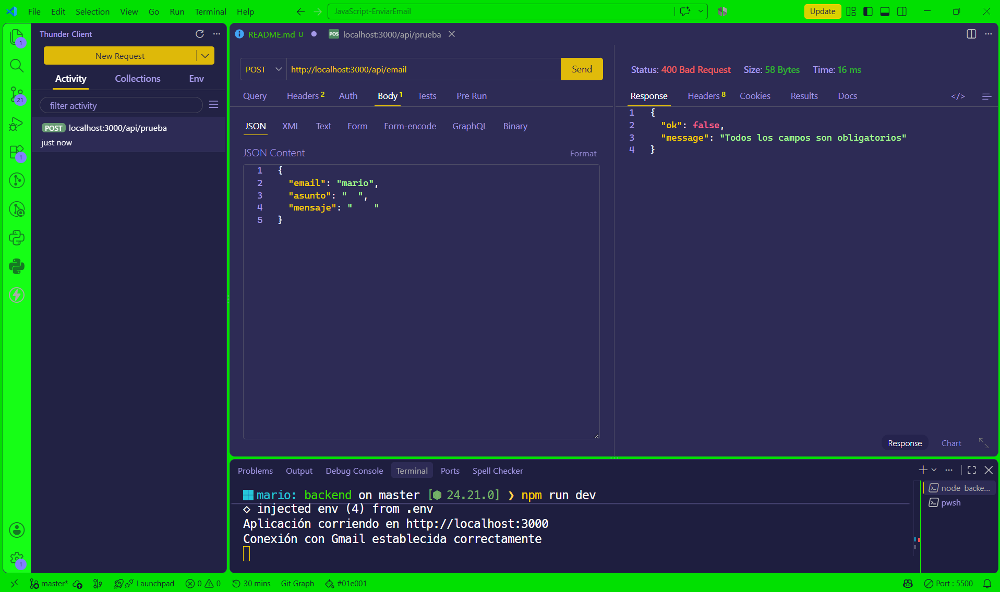
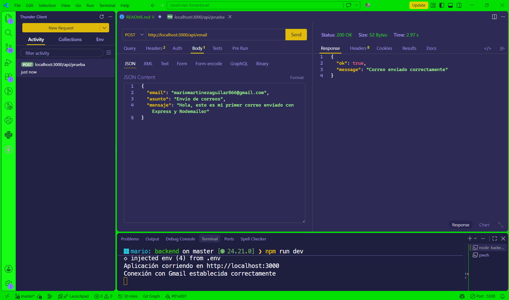

# 📧 Envío De Emails

Aplicación web que permite enviar correos electrónicos mediante un formulario de contacto a un backend desarrollado con **Node.js y Express**.  🚀

## 📝 Descripción

Este proyecto integra un fronted desarrollado con **HTML,CSS y JavaScript** con una API que procesa y valida los datos del formulario y utiliza **Nodemailer** para enviar correos electrónicos a través de Gmail.

🎯 El objetivo del proyecto es practicar la integración entre el frontend y backend, el manejo de peticiones HTTP, la validación de datos, la configuración de variables de entorno y el envío de correos electrónicos mediante SMTP.

## Vista previa de nuestra aplicación web 


## ☄️ Características Del Proyecto
* 🗒️ Formulario de contacto
* 🔗 Comunicación entre frontend y backend mediante `fetch`.
* ⚙️ API desarrollada con Express.
* 🛡️ Validación de los datos recibidos en el servidor.
* 📩 Envío de correos electrónicos mediante Nodemailer y Gmail.
* 🚨 Manejo de respuestas HTTP y errores.
* 🌐 Configuración de CORS para el entorno de desarrollo.
* 🔐 Uso de variables de entorno para proteger las credenciales.

## Vista previa de nuestro proyecto enviando el correo correctamente mediante un spinner de carga:


## Mostrando mensaje cuando el spinner de carga termina y el correo se envía es decir xse muestra una alerta de éxito al usuario que todo fue enviado exitosamente:


## Vemos que el correo ha llegado a su destino en el correo colocado en el formulario y fue recibido realmente:


## 🛠️ Tecnologías utilizadas

* 🌐 **HTML5** — estructura del formulario.
* 🎨 **CSS3 y Tailwind CSS** — estilos e interfaz visual.
* ⚡ **JavaScript** — validaciones y comunicación con el backend.
* 🟢 **Node.js** — entorno de ejecución del servidor.
* 🚂 **Express** — creación de la API.
* 📬 **Nodemailer** — envío de correos electrónicos.
* 🔑 **dotenv** — gestión de variables de entorno.
* 🔄 **CORS** — control de los orígenes permitidos para las peticiones desde el navegador.

## 🧰 Herramientas utilizadas en proyecto
* 💻 Visual Studio Code - editor de código
* 🧪 Thunder Client — pruebas de los endpoints de la API y validación de las respuestas HTTP.
* 🔥 Nodemon — reinicio automático del servidor durante el desarrollo.
* 🚀 Git y GitHub — control de versiones y alojamiento del repositorio.

## 🎓 Objetivo de aprendizaje

Este proyecto forma parte de mi aprendizaje en desarrollo web full-stack y tiene como finalidad comprender cómo se comunican el frontend y el backend para implementar una funcionalidad real de envío de correos electrónicos.

## Mostrando validaciones en el formulario colocando mensajes de alertas para mejorar la experiencia de usuario.(Validación de campos, correos electrónicos validos y habilitación de botones en el formulario).


## Ahora vemos que sucede si el envío del correo falla, también logramos controlar errores de este tipo en nuestra aplicación para que sea mas amigable para el usuario mostrando también una alerta de error.



## 🧪 Pruebas del Backend

El backend fue probado utilizando **Thunder Client** para verificar el funcionamiento de los endpoints, la validación de datos y el envío de correos electrónicos.

### ✅ Recepción y validación de datos

Se realizó una petición `POST` al endpoint `/api/prueba` para comprobar que el servidor recibe y valida correctamente los datos enviados vemos que si la comunicación con el backend fue exitosa.


### ⚠️ Validación de datos incorrectos

Se realizaron pruebas enviando datos incompletos y formatos de correo no válidos para comprobar que el servidor responde correctamente con errores HTTP esto ya se hizo en el endpoint real de nuestra aplicación.

## Correo electrónico inválido usando regex para su validación


## Campos de datos incompletos o vacíos validaciones usando JavaScript


### 📧 Envío de correo electrónico

Se probó el endpoint `/api/email` para verificar que el backend procesa la solicitud y envía correctamente el correo electrónico mediante Nodemailer.


## 🚀 Instalación y configuración del proyecto

### 📥 1. Clonar el repositorio
Clona el repositorio en tu equipo utilizando Git:
```bash
    git clone https://github.com/MarioMartinezAguilar/envio-de-emails
```

Después, entra en la carpeta del proyecto:
```bash
    cd nombre-del-proyecto
```

### 📦 2. Instalar las dependencias
Entra en la carpeta del backend:
```bash
    cd backend
```

Instala las dependencias del proyecto:
```bash
    npm install
```
Esto instalará automáticamente los paquetes definidos en `package.json`, necesarios para ejecutar el servidor.

### 🔐 3. Configurar las variables de entorno
Dentro de la carpeta `backend`, crea un archivo llamado `.env`.

Este archivo contiene las credenciales necesarias para conectar el backend con el servicio de correo.
Utiliza la siguiente estructura:
```env
    SMTP_HOST=smtp.gmail.com
    SMTP_PORT=465
    SMTP_USER=tu_correo@gmail.com
    SMTP_PASSWORD=tu_app_password
```
> ⚠️ **Importante:** nunca publiques el archivo `.env` en GitHub. Las credenciales deben mantenerse privadas.

### 📧 4. Configurar Gmail
Para utilizar Gmail como servidor SMTP es necesario tener activada la **verificación en dos pasos** y generar una **contraseña de aplicación**.

La contraseña de aplicación debe utilizarse en `SMTP_PASSWORD` en lugar de la contraseña habitual de la cuenta de Gmail.

Una vez configuradas las variables de entorno, el backend podrá establecer la conexión con Gmail y enviar los correos electrónicos mediante **Nodemailer**.

## ▶️ Ejecución del proyecto

### 🟢 1. Iniciar el backend
Desde la carpeta `backend`, ejecuta:
```bash
    npm run dev
```
Esto iniciará el servidor utilizando **Nodemon**, permitiendo que se reinicie automáticamente cuando se realicen cambios en el código. El backend estará disponible en:
```text
    http://localhost:3000
```

### 🌐 2. Iniciar el frontend
Abre el archivo `index.html` utilizando **Live Server** desde Visual Studio Code.
El frontend se abrirá en una dirección similar a:
```text
    http://127.0.0.1:5500
```
Una vez iniciados ambos servicios, el formulario podrá comunicarse con el backend y realizar el envío de correos electrónicos.

## 📁 Estructura del proyecto

```text
    📦 JavaScript-EnviarEmail
    ├── 📄 index.html
    ├── 📁 js
    |    └── 📄 app.js
    ├── 📁 dist
    │   ├── 🎨 app.css
    │   └── 🔄 spinner.css
    ├── 📁 backend
    │   ├── 📄 server.js
    │   ├── 📄 package.json
    │   ├── 📄 package-lock.json
    │   └── 📄 .gitignore
    |   └── 📄 .nvmrc
    ├── 📄 .gitignore
    └── 📄 README.md
```
### 📌 Descripción de los archivos principales
* 📄 **`index.html`** — estructura principal del formulario.
* 📄 **`app.js`** — validaciones del formulario y comunicación con el backend.
* 🎨 **`dist/app.css`** — estilos generados con Tailwind CSS.
* 🔄 **`dist/spinner.css`** — estilos utilizados para el indicador de carga.
* ⚙️ **`backend/server.js`** — servidor Express, validación de datos y envío de correos mediante Nodemailer.
* 📦 **`backend/package.json`** — configuración del proyecto backend y sus dependencias.
* 🔒 **`.gitignore`** — archivos y carpetas que no deben incluirse en el repositorio.
* 📄 **`.nvmrc`** - Versión de node que se utilizo en este proyecto.
* 📖 **`README.md`** — documentación del proyecto.

## ☁️ Despliegue

### 🌐 Frontend
El frontend se encuentra desplegado en **Netlify**.
la versión desplegada corresponde a la interfaz del formulario y permite visualizar y utilizar la aplicación desde el navegador vemos como esta construido el formulario simulando el envío del correo electrónico

### Backend
El backend funciona correctamente en entorno local y permite enviar correos mediante **Gmail SMTP**.
Durante las pruebas de despliegue se comprobó que algunos servicios de hosting gratuitos restringen las conexiones SMTP salientes necesarias para este funcionamiento.
Por este motivo, el backend se mantiene actualmente en entorno local para conservar la configuración de envío de correos sin depender de servicios de pago.

> 💡 **Nota:** El envío de correos fue probado y verificado correctamente en entorno local.

## 👨‍💻 Autor

**Mario Martinez Aguilar**

Proyecto desarrollado como parte de mi proceso de aprendizaje en desarrollo web full-stack, poniendo en práctica la integración entre frontend y backend, el manejo de APIs y el envío de correos electrónicos mediante SMTP.


